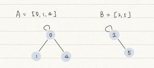
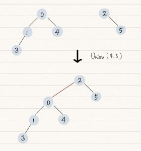
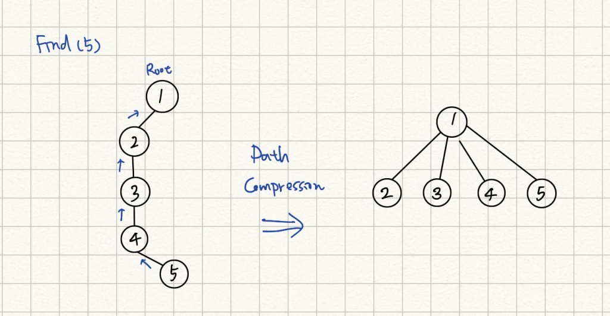
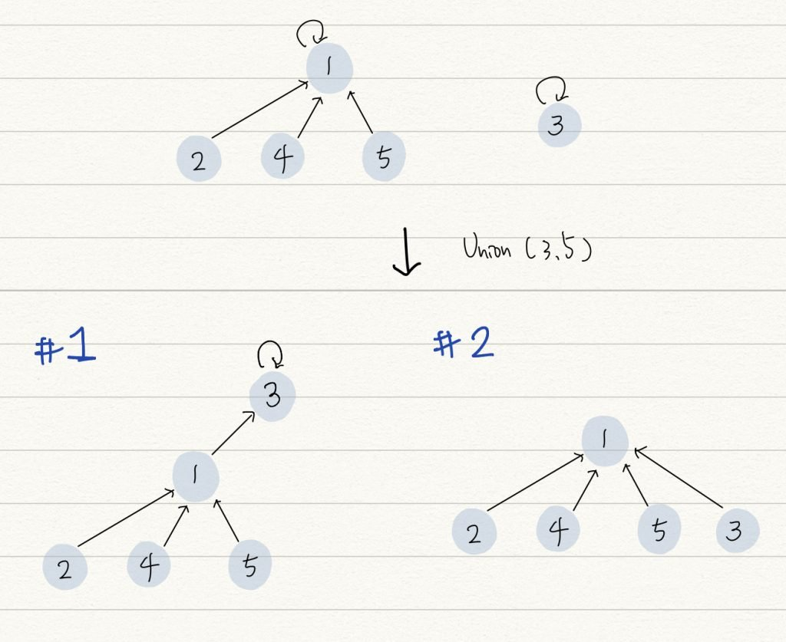

Union-Find data structure ，又稱為 Disjoint-set data structure，用於處理不相交集合 (disjoint set) 的合併 (Union) 與查詢 (Find) 問題，最常用在圖中有 [connected component](https://en.wikipedia.org/wiki/Component_(graph_theory)) 的情境 。

## Disjoint set

先看 "set" 這個單字，set 在 computer science 領域指的是一組資料的集合，set 內部的資料是不重複的，資料之間的順序並不重要。

而 disjoint set 表示數個 set 之間，擁有的元素都不相同，彼此互斥（disjoint）。例如 A = {1, 2, 3}, B = {4, 5} ，A 和 B 即為 disjoint set 。

在講解 Union-Find 實作之前，推薦大家去看這篇文章 [Ch21 並查集 - Disjoint Set](https://hackmd.io/@CLKO/rkRVS_o-4?type=view) ，這篇文章將 disjoint set 的優點講的簡單明瞭，很值得一看！

## Union-Find Algorithm

Union-Find data structure 是一種 [forest](https://en.wikipedia.org/wiki/Tree_(graph_theory)#Forest) 結構，forest 是一種 N-way Tree 結構，互相連通的節點放在同一組 set ，任意選擇其中一個節點作為 root 。



Union-Find 提供以下兩種操作：

- Find : 找到 input 節點的 root ，可以藉此確定 input 節點屬於哪一個子集 。
- Union : 將兩個子集合併為同一子集。

Find 函數能夠找到節點的 root ，如果要確認兩個節點是否屬於同一子集，只要分別找兩節點的 root ，如果一樣，即代表屬於同一子集 (為 connected component)。

Find 的時間複雜度，最差狀況就是遍歷整棵樹，若樹呈現極度不平衡如同一個 linked list ，時間複雜度為 `O (n)` 。

Union 能夠將兩個點所屬的子集進行合併，合併最簡單方法是將一個子集的 root 直接作為另外一個子集 root 的子節點即可，如下圖，將左邊的樹作為右邊樹的 subtree ：



Union 的實現需要依靠 Find ，因此時間複雜度最差將為 O (n) 。

Find 跟 Union 的執行時間都是線性等級，這樣的資料結構顯然不是好用的，你可能會想到平衡二元樹，其樹的高度維持在 O (log n) ，因此想要降低操作的時間複雜度，需要避免樹的不平衡。

以上圖的兩個樹來說，以 0 為 root 的樹大於以 2 為 root 的，如果將後者合併到前者下，合併過後的樹高度會比較小，根據這個觀察可以歸納出，如果兩個子集要合併，應該讓高度較小的子集合併到比較大的子集下，可以避免樹的不平衡。以下分別介紹 Find with path compression 和 union by size 兩個技巧。

### Find with Path Compression

Path compression 是一個優化技巧，也有人稱為 set collapsing ，讓每個節點直接連到它的 root 節點，這樣 Find 跟 Union 操作的時間複雜度可以降低到 O (1) 。

以下圖為例，透過 Find 來找節點 5 的 root ，會不斷的往上走訪 parent nodes 直到找到 root ，每次找尋該節點的 root 最壞時間複雜度都要將近 O (n) ，這個動作可以進一步優化，讓所有走訪過的節點的 parent node 都直接指向 root ，這樣一來每次 Find 的執行最佳只需要 O (1) 即可。 

但要如何有效地讓所有節點 parent node 都指向 root 呢? 答案就是透過**遞迴**，透過遞迴找到 root ，再依序回傳更新為每個走訪過節點的 parent 。

```cpp
int Find (int a) {
    if (a == parent[a])
        return a;
    return parent[a] = Find (parent[a]);
}
```

### Union by size / rank

應用 path compression 後的樹可以盡可能縮減樹的高度 ，若要再 Union 兩個壓縮後的子集，可以採取 union by size 技巧，將子節點比較少的 root 加入比較大的子集。

另外一種是依照 rank 來排序，起初每個點的 rank 均為 0 ，依據 rank 大小來決定如何合併，rank 大的子集合併小的，合併別人的子集其 rank 往上增加。

Union by rank 程式碼如下，一開始每個點的 rank 都為 1 ，有一點特別容易寫出 bug ，在比較彼此 rank 或是更新 rank 時候，需要以 `Find()` 所找出的 root 來比，不是各個節點本身的 rank 。

```cpp
void unionSet(int a, int b) {
    int root_a = Find(a);
    int root_b = Find(b);
    if (root_a != root_b) {
        if (rank[root_a] > rank[root_b]) {
            parent[root_b] = root_a;
        }
        else if (rank[root_a] < rank[root_b]) {
            parent[root_a] = root_b;
        } else {
            parent[root_b] = root_a;
            rank[root_a]++;
        }
    }
}
```

### 如果有了 path compression ，是否還需要依據 size 或 rank 來決定合併順序？

有了 Find with path compression ， forest 的高度可以盡可能縮小，不過你必須清楚了解，Find 要發揮最大作用，必須是將 Find() 使用在 leaf 上，若 Union 的兩個節點都分屬兩個 forest 的 root 節點，那 Path compression 根本派不上用場。

由下圖兩個 case 來看，此時執行 Union(1, 3) ，會有兩種結果， case 1 並沒有依據 size 來決定合併關係，就需要再做多次的 path compression 來將第三層的節點移到第二層，反觀 case 2 就不需要，由這兩個 case 可以了解即便有了 path compression ，再依據 size 或 rank 來決定合併確實更佳優化。



## 優化後的 Disjoint Set 的複雜度

### Time Complexity

建造整個 union find class 需要 O(N) ，其中 N 為 Node 數量。 Find 操作的時間複雜度為 O (α(N)) 。 其中 α 代表[inverse Ackermann function](https://xlinux.nist.gov/dads/HTML/inverseAckermann.html) ，實際上會假設它是一個常數值，因此可以視為平均時間複雜度為 O(1) 。 而 Union 操作又依賴 Find ，所以 Union 的時間複雜度也可以視為 O(1) 。

### Space Complexity

O(N)

## Leetcode #200 Number of Islands

題目所求就是從圖中找出 connected component 數量。

class `UnionFind` 負責處理 union-find data structure ，在 class `UnionFind` 的 Constructor 中，針對每個 land 節點先將其 parent 設為自己，也代表每個節點自己都是一個 connected component ，而 water 節點的 parent 則設為 -1 ，以上是初始化 UnionFind class 的動作。 初始化完，有多少個座標為 1 的點，就會有多少個 component ，但 point 跟 point 之間相連的話，只能算為一個 componet ，因此接下來透過使用 Union() 來連結 。

依序由每個 land 出發，如果每個 land 四周也同樣是 land 節點，即透過 `Union(int point1, int point2)` 來連結，走訪過的點直接修改為 water 節點，避免被重複執行 Union ，所有 land 都走訪過並確認是否需要連結後，即可得到最終 component 數量。

- 千萬不要把 union find 跟 DFS/BDF 搞混，DFS 需要遞迴處理，而 BFS 會使用 queue 來儲存待處理節點，而 union find 單純把所有的點走訪過，只要需要相連，呼叫 union() 來處理即可。

```cpp
class UnionFind {
    public:
    UnionFind(vector<vector<char>>& grid) {
        count = 0;
        for (int i=0; i<grid.size (); i++)
        {
            for (int j=0; j<grid[0].size (); j++)
            {
                if (grid[i][j] == '1')
                {
                    parent.push_back(i*grid[0].size() + j);
                    count++;
                }
                else
                {
                    parent.push_back(-1);
                }
                rank.push_back(0);
            }
        }
    }

    int find(int i) { // path compression
        if (i != parent[i]) {
            parent[i] = Find(parent[i]);
        }
        return parent[i];
    }

    void Union(int x, int y) { // union with rank
        int root_x = find (x);
        int root_y = find (y);
        if (root_x != root_y)
        {
            if (rank[root_x] > rank[root_y])
            {
                parent[root_y] = root_x;
            }
            else if (rank[root_y] > rank[root_x])
            {
                parent[root_x] = root_y;
            }
            else
            {
                parent[root_y] = root_x;
                rank[root_x] +=1;
            }
            count--;
        }
    }

    int getCount() const {
        return count;
    }

    private:
    vector<int> parent;
    vector<int> rank;
    int count; // # of connected components
};

class Solution {
    public:
    int numIslands(vector<vector<char>>& grid) {
        int col = grid.size ();
        int row = grid[0].size ();

        UnionFind uf (grid);
        for (int i=0; i<col; i++)
        {
            for (int j=0; j<row; j++)
            {
                if (grid[i][j] == '1')
                {
                    grid[i][j] = '0';
                    if (i-1 >= 0 && grid[i-1][j] == '1') uf.Union (i*row+j, (i-1)*row+j);
                    if (i+1 < col && grid[i+1][j] == '1') uf.Union (i*row+j, (i+1)*row+j);
                    if (j-1 >=0 && grid[i][j-1] == '1') uf.Union (i*row+j, i*row+(j-1));
                    if (j+1 < row && grid[i][j+1] == '1') uf.Union (i*row+j, i*row+(j+1));
                }
            }
        }
        return uf.getCount ();
    }
};
```

### 時間複雜度

時間複雜度為 O (M x N) ，M, N 分別為輸入陣列的長跟寬，最壞狀況下 DFS 會將所有點都走過。

### 空間複雜度

空間複雜度為 O (M x N) ，每個點需要紀錄其 parent 與 rank 。

## Leetcode #684 Redundant Connection

本題要問去除哪一個 edge 來讓圖中不會形成 cycle ，回想 Union-Find algorithm ，Union 方法就是將兩個子集合在一起，並形成一個新的 forest 結構，但是兩個子集可以合為一個 forest ，是基於兩個子集沒有交集的前提，也就是說他們的 root 不一樣，若是兩子集有共同 root ，又將兩個點連起來，就會形成 cycle 。

將每個 edge 的兩點 union 起來，在 Union 操作內將執行 Find 找兩點的 root， 若 root 一樣，代表找到會形成 cycle 的 edge 。

```cpp
class Solution {
public:
    vector<int> parent;
    vector<int> rank;
    int Find (int x)
    {
        while (x != parent[x])
        {
            parent[x] = parent[parent[x]];
            x = parent[x];
        }
        return x;
    }
    bool Union (int x, int y)
    {
        int rootX = Find (x);
        int rootY = Find (y);
        if (rootX == rootY)
        {
            return false;
        }
        else
        {
            if (rank[rootX] > rank[rootY])
            {
                parent[rootY] = rootX;
            }
            else if (rank[rootY] > rank[rootX])
            {
                parent[rootX] = rootY;
            }
            else
            {
                parent[rootX] = rootY;
                rank[rootY]++;
            }
        }
        return true;
    }
    vector<int> findRedundantConnection(vector<vector<int>>& edges)
    {
        for (int i=0; i<= edges.size(); i++)
        {
            parent.push_back (i);
            rank.push_back (0);
        }

        for (int i=0; i<edges.size(); i++)
        {
            if (!Union (edges[i][0], edges[i][1]))
            {
                return vector<int> {edges[i][0], edges[i][1]};
            }
        }
        return {};
    }
};
```

### 時間複雜度

O (N) ，其中 N 可能為題目給的 edge 數量或是 node 數量。

### 空間複雜度

O (N) ，N 為 node 數量。

#### 延伸問題 Leetcode #261, [#547](https://leetcode.com/problems/number-of-provinces/), [#721](https://leetcode.com/problems/accounts-merge/)

## Reference

1. [Disjoint Set Union CP-Algorithms](https://cp-algorithms.com/data_structures/disjoint_set_union.html)
2. [Disjoint-set data structure - wikipedia](https://en.wikipedia.org/wiki/Disjoint-set_data_structure)
3. [普林斯頓課程學習筆記1-union-find](https://medium.com/@gxyou45/algorithm%E6%99%AE%E6%9E%97%E6%96%AF%E9%A0%93%E8%AA%B2%E7%A8%8B%E5%AD%B8%E7%BF%92%E7%AD%86%E8%A8%981-union-find-5af7911ca5ef)
4. [演算法筆記 Set](http://web.ntnu.edu.tw/~algo/Set.html)
5. [演算法筆記 Minimum Spanning Tree](http://web.ntnu.edu.tw/~algo/SpanningTree.html#2)
6. [Union-Find算法详解 - labuladong算法博客](https://labuladong.github.io/algo/2/19/38/)

Updated on _2023-01-08 22:47:08 星期日_
